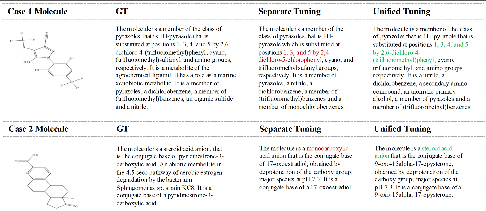

## Section 1: Supplemantary results on experimentally measured and classification data

> We incorporate two binary classification datasets of molecular biological activity, namely BBBP and HIV. These two datasets are collected from wet-lab data described in MoleculeNet. In our classification settings, all dataset samples are converted into an instruction format and we use the recommended splits. In the table below, we report our results by unified SFT and the baseline results for comparison. We can still observe outperforming advantages caompared with InstructMol.

| Model        | BBBP | HIV  |
|--------------|------|------|
| InstructMol  | 70.0 | 74.0 |
| Ours         | 89.7 | 96.8 |

----------

## Section 2: Comparison results of RDKit and ours

> The inclusion of certain regression tasks that can also be performed by RDKit serves to achieve a more generalizable representation space, as outlined in our paper. By training the model on multiple regression tasks, we aim to enhance its ability to leverage shared patterns across tasks, thereby improving overall performance. As demonstrated in table below, our model outperforms RDKit in predicting key properties such as LogP and Complexity, further validating the benefits of our multi-task learning approach.

| Property    | MAE (RDKit) | Ours  |
|-------------|-------------|-------|
| LogP        | 1.0619      | 0.59  |
| Complexity  | 201.4198    | 49.38 |

---------

## Section 3: Supplemantary results on IUPAC name identification

|Model|ACC|
|-----|---|
|InstructMol|3.2|
|Ours|6.7|

-----------

## Section 4: Supplemantary Molcap case study

As shown in the figure, higher scores generally indicate that the model can correctly answer a certain aspect of the descriptive task.

-----------

## Section 5: The complete responses

> Q1: Represent entire chemical space.

> A1: Thanks for your advice. The core contribution of Omni-Mol lies in using a single large language model to uniformly fine-tune as many downstream tasks as possible. This is the intended meaning behind the term ``omni-molecular task” in our title, not to represent the entire molecular space. To the best of our knowledge, Omni-Mol is currently capable of handling the largest variety of tasks simultaneously, especially in comparison to the work you mentioned in the review below. Moreover, Omni-Mol demonstrates strong scaling capabilities: more data and computational resources only serve to enhance Omni-Mol’s performance, as supported by both the ablation studies in our paper and the additional experiments we have now included. Given that current computational power and data availability fall far short of simulating the entire chemical space, we believe that our work represents a significant step forward based on existing foundations. Therefore, it holds substantial value for the future development of the entire community.

> Q2: Lack of experimentally measured data and classification data.

> A2: Thank you for raising the point regarding wet-lab experiments. Our decision to limit the use of wet-lab data in training was driven by two primary methodological concerns:
**(1) Data Volume and Distribution:** Wet-lab datasets are typically small-scale, which restricts the model’s ability to learn robust, generalizable patterns across diverse data distributions.
**(2) Label Reliability:** The inherent variability and methodological limitations of wet-lab experiments (e.g., experimental noise, reproducibility challenges) can introduce label inaccuracies or ambiguities, thereby compromising data reliability.
We also strategically incorporated a subset of carefully curated wet-lab data during training. The details of data is below.

Table 1: Dataset information of classification data.
| Dataset | Train | Test | Total |
|---------|-------|------|-------|
| BBBP    | 1832  | 204  | 2036  |
| HIV     | 36967 | 4108 | 41075 |
| **Total**  | **40161** | **4463** | **44624** |

> We incorporate two binary classification datasets of molecular biological activity, namely BBBP and HIV. These two datasets are collected from wet-lab data described in MoleculeNet. In our classification settings, all dataset samples are converted into an instruction format and we use the recommended splits. In the table below, we report our results by unified SFT and the baseline results for comparison. We can still observe outperforming advantages caompared with InstructMol.

| Model        | BBBP | HIV  |
|--------------|------|------|
| InstructMol  | 70.0 | 74.0 |
| Ours         | 89.7 | 96.8 |

> Q3: Lack of multi-step retrosynthesis and reaction conditions.

> A3: Thanks for your comment. We have reviewed multiple related papers, and found that the mainstream approach for multi-step retrosynthesis is a combination of single-step synthesis and search algorithms. Currently, there is no large-scale, instruction-based dataset available for multi-step retrosynthesis. To ensure fair comparisons with existing methods, we adopt the datasets published in *Mol-Instructions* (ICLR’24), *BioT5* (ACL’24), and *InstructMol* (COLING’25). Moreover, our step prediction task incorporates rich contextual conditions, such as explicit reaction conditions, reactant quantities, reaction temperatures, experimental procedures, and the actual yields of the products. Therefore, our method builds upon existing LLM-based approaches to realize *omni-molecular generalists*, with strong scalability. As such, our claims are both well-founded and traceable.

> Q4: Insufficient tasks.
> 

> A4: For LLM–based methods, both protein and material data can essentially be transformed into tokens using specific encoders, allowing them to be integrated into our unified framework. The key contribution of Omni-Mol is the first proposal of a unified and scalable framework in the molecular domain, which achieves strong performance across 15 tasks. Compared to existing methods published at top conferences, such as Uni-Mol (ICLR’23), Mol-Instructions (ICLR’24), BioT5 (ACL’24), and InstructMol (COLING’25), Omni-Mol clearly demonstrates the potential of extending large language models to a broader range of domains when supported by sufficient computational resources.
> 

> Q5: Lack of modalities.
> 

> A5: Thank you for your insightful comment. In fact, all the aforementioned modalities can be transformed into tokens using modality-specific tokenizers. Our unified encoding framework is designed to be modality-agnostic and can seamlessly accommodate these tokenized inputs. That said, the focus of this work is specifically on molecular tasks, where we demonstrate the effectiveness of our approach across diverse molecular modalities.
> 

> Q6: Doubt on backbone.
> 

> A6: We simply chose the most popular open-source model, Llama3, as our backbone. In fact, our method is backbone-agnostic. As shown in Figure 4, the performance further improves when scaling up to 3B and 8B models. You can also refer to Appendix A6 for Reviewer QVuL to see the corresponding validation.
> 

> Q7: Doubt on RDKit.

> A7: Thank you for your comment. The inclusion of certain regression tasks that can also be performed by RDKit serves to achieve a more generalizable representation space, as outlined in our paper. By training the model on multiple regression tasks, we aim to enhance its ability to leverage shared patterns across tasks, thereby improving overall performance. Additionally, as demonstrated in Table below, our model outperforms RDKit in predicting key properties such as LogP and Complexity, further validating the benefits of our multi-task learning approach.

| Property    | MAE (RDKit) | Ours  |
|-------------|-------------|-------|
| LogP        | 1.0619      | 0.59  |
| Complexity  | 201.4198    | 49.38 |

> Q8: Doubt on evaluation.
> 

> A8: We appreciate the reviewer’s critical suggestions regarding our metrics. The BLEU score reflects the accuracy of the model’s responses, while the ROUGE score indicates the recall of relevant information. These metrics are standard in existing molecular LLM literature(3D-MoLM(ICLR’24), InstructMol(COLING’25)); improvements in either BLEU or ROUGE suggest that the model has correctly captured more content from the reference, such as classifications, names, and functional groups, or that it has successfully retrieved additional correct information from the reference. As demonstrated there, the model trained with separate training strategy (which shows lower BLEU and ROUGE scores) indeed answered some properties incorrectly, whereas Omni-Mol correctly addressed those parts, and it will be reflected in the improvement of the metrics we adopted for Molcap. Once again, we thank the reviewer for the constructive feedback on our metric selection. 
> 

> Q9: There is no evaluation of molecular generation or design tasks.
> 

> A9: Thank you for your comment. Unifying both generation and understanding within a single model remains a significant challenge, especially in the molecular domain. Existing language model architectures often struggle to accommodate the distinct demands of molecular understanding (e.g., property prediction, classification) and molecular generation (e.g., reaction prediction, retrosynthesis). As a result, it is rare to see models that effectively handle both aspects simultaneously.
> 

> Omni-Mol addresses this gap by enabling **one model to fit all**, seamlessly supporting a wide range of molecular tasks across both understanding and generation. This unified capability not only simplifies the pipeline but also provides a strong and scalable baseline for future research, particularly in molecular generation tasks that are still under active exploration.

> Q10: Baseline classifications.

> A10: Thank you for your comment. While InstructMol and HIGHT present themselves as generalist models, they are, in fact, trained separately for different tasks using exclusive LoRA weights dedicated to each task.
>
> Q11: Definitions of "specialist" and "generalist".
>
> A11: Thank you for your comment. We define the term “specialist” in line 925, but we would like to clarify it further. Generalist models are trained on multiple tasks simultaneously, with shared weights across different tasks. In contrast, specialist models are trained separately for each task, maintaining exclusive weights specific to each task.
>
> Q12: Doubt on training strategy of baselines.
>
> A12: Thank you for your comment. All our baselines are LLM-based. The models in Table 2 are either trained with SFT or constructed using retrieval-augmented generation. Some, such as HIGHT, InstructMol (Llava-like), and 3D-MoLM (BLIP2-like), incorporate multi-modal LLM architectures, while others are pure LLMs. Similarly, the models in Table 3 are fine-tuned from LLMs, where numerical data is converted to text, and the LLMs are trained to predict the resulting numbers in a next-token manner. The predicted text is then converted back to floating-point numbers for MAE calculation.
>
> Q13: IUPAC name evaluation
>
> A13: Accuracy of Omni-Mol is xx, much higher than InstructMol(xx)
>
> Q14: Why are BLEU, RDK, MACCS, and Morgan metrics used in the reaction tasks
>
> A14: Thank you for your comment. These metrics provide a multi-faceted evaluation of reaction predictions: BLEU ensures textual and sequence-based fidelity, while RDK, MACCS, and Morgan fingerprints evaluate molecular similarity at different levels of granularity. Their combination is essential for ensuring that the predicted reactions are both syntactically accurate and chemically meaningful. They are commonly used in existing works.
>
> Q15: > Is there empirical evidence supporting Figure 1?
>
> A15: Thank you for your comment. In fact, Figure 1 serves as a visual illustration of Section 3.6. We designed similarity-based experiments to indirectly support the claim that Omni-Mol converges to a unified representation space, while InstructMol diverges as the number of tasks increases. Figure 7 provides additional experimental evidence supporting Figure 1.
>
> Q16: How do you define "negligible gains" as mentioned in Line 56?
> 

> A16: Thank you for your comment. In InstructMol, the authors conducted an ablation study on scaling up the LLM backbone but found that performance showed little to no improvement, with one metric even declining. For details, please refer to Table 6 in the InstructMol paper.
> 

> Q17: How can the complexity of the training strategy be quantitatively compared? The proposed work also introduces a highly complex training strategy, yet complexity is described as a disadvantage in Lines 57–58.
>
> A17: Thank you for your comment. The high training complexity in PRESTO stems from its large-scale pre-training, which involves progressive multi-stage training on approximately 3,400,000 samples. In contrast, our method requires only a single pre-training stage with around 310,000 samples, meaning PRESTO requires 9.44 times more training samples before any task-specific fine-tuning.

> Q18: Does the definition of conflict collapse originate from other domains, or is it specific to the molecular domain? If it is the latter, could it be applied to other domains? What is the principle used to define conflict collapse?

> A18: Thank you for your comment. Our motivation is rooted in the Platonic representation hypothesis, which suggests that as a model learns more tasks together, its representation space becomes more compact, ultimately leading to a more generalizable solution set. However, we observed that naively training multiple tasks under the InstructMol framework often results in performance drops across many tasks. This led us to identify conflict collapse, indicating that naive multitask training may fail to converge to a truly generalizable solution space.

> Q19: What is the motivation for using the graph encoder? What is the reason for choosing SELFIES instead of SMILES? SELFIES was introduced much later than SMILES, which means pretrained LLMs may not have a strong understanding of it. Why not use SMILES, which is widely used in existing literature and is more likely to be well covered in the pretraining corpus of LLMs?
>
> A19: We incorporate GNN-based graph features to enable the LLM to leverage molecular topology, thereby enhancing its performance. The effectiveness of graph features has already been validated in InstructMol. Compared to SMILES, SELFIES is a more robust molecular representation. In fact, the authors of the PRESTO paper also suggest using SELFIES in future work to achieve higher validity.
